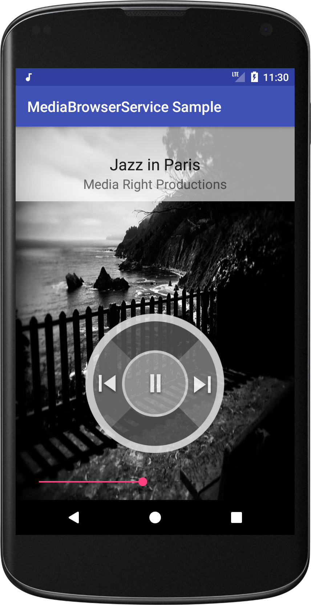
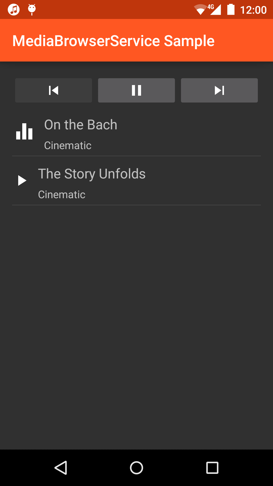
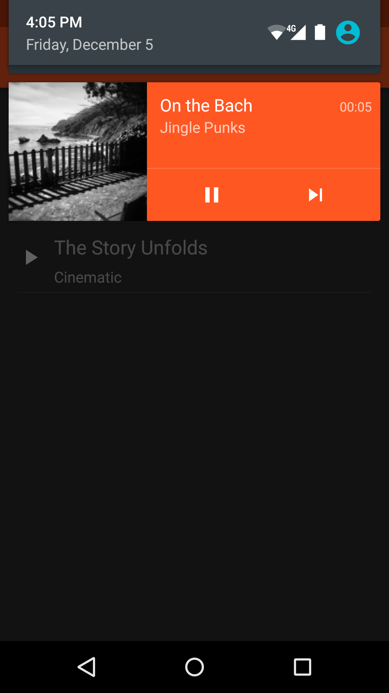

Android MediaBrowserService Sample
===================================

This sample shows how to implement an audio media app that provides
media library metadata and playback controls through a standard
service. It exposes a simple music library through the new
MediaBrowserService and provides MediaSession callbacks. This allows
it to be used in Android Auto, for example.
When not connected to a car, the app has a very simple UI that browses
the media library and provides simple playback controls. When
connected to Android Auto, the same service provides data and callback
to the Android Auto UI in the same manner as it provides them to the
local UI.

Introduction
------------

To implement a MediaBrowserService, you need to:

- Extend android.service.media.MediaBrowserService, implementing the media
  browsing related methods onGetRoot and onLoadChildren;

- In onCreate, start a new MediaSession and call super.setSessionToken() with
  this MediaSession's token;

- Set a MediaSession.Callback class on the MediaSession. The callback class
  will receive all the user's actions, like play, pause, etc;

- Handle all the actual music playing using any method your app prefers
  (for example, the Android MediaPlayer class)

- Whenever it changes, update info about the playing item and the playing
  queue using MediaSession corresponding methods (setMetadata,
  setPlaybackState, setQueue, setQueueTitle, etc)

- Handle AudioManager focus change events and react appropriately
  (e.g. pause when audio focus is lost)


To make it compatible with Android Auto, you also need to:

- Declare a meta-data tag in AndroidManifest.xml linking to a xml resource
  with a automotiveApp root element. For a media app, this must include
  an &lt;uses name="media"/&gt; element as a child.

  For example, in AndroidManifest.xml:
```
     <meta-data android:name="com.google.android.gms.car.application"
       android:resource="@xml/automotive_app_desc"/>
```

  And in res/xml/automotive\_app\_desc.xml:
```
      <?xml version="1.0" encoding="utf-8"?>
      <automotiveApp>
          <uses name="media"/>
      </automotiveApp>
```

- Declare and export the service in AndroidManifest.xml:
```
    <service
        android:name=".service.MusicService"
        android:exported="true">
      <intent-filter>
         <action android:name="android.media.browse.MediaBrowserService" />
      </intent-filter>
    </service>
```

Pre-requisites
--------------

- Android SDK v23
- Android Build Tools v23.0.0
- Android Support Repository

Screenshots
-------------

   

Getting Started
---------------

This sample uses the Gradle build system. To build this project, use the
"gradlew build" command or use "Import Project" in Android Studio.

Support
-------

- Google+ Community: https://plus.google.com/communities/105153134372062985968
- Stack Overflow: http://stackoverflow.com/questions/tagged/android

If you've found an error in this sample, please file an issue:
https://github.com/googlesamples/android-MediaBrowserService

Patches are encouraged, and may be submitted by forking this project and
submitting a pull request through GitHub. Please see CONTRIBUTING.md for more details.

License
-------

Copyright 2014 The Android Open Source Project, Inc.

Licensed to the Apache Software Foundation (ASF) under one or more contributor
license agreements.  See the NOTICE file distributed with this work for
additional information regarding copyright ownership.  The ASF licenses this
file to you under the Apache License, Version 2.0 (the "License"); you may not
use this file except in compliance with the License.  You may obtain a copy of
the License at

http://www.apache.org/licenses/LICENSE-2.0

Unless required by applicable law or agreed to in writing, software
distributed under the License is distributed on an "AS IS" BASIS, WITHOUT
WARRANTIES OR CONDITIONS OF ANY KIND, either express or implied.  See the
License for the specific language governing permissions and limitations under
the License.
